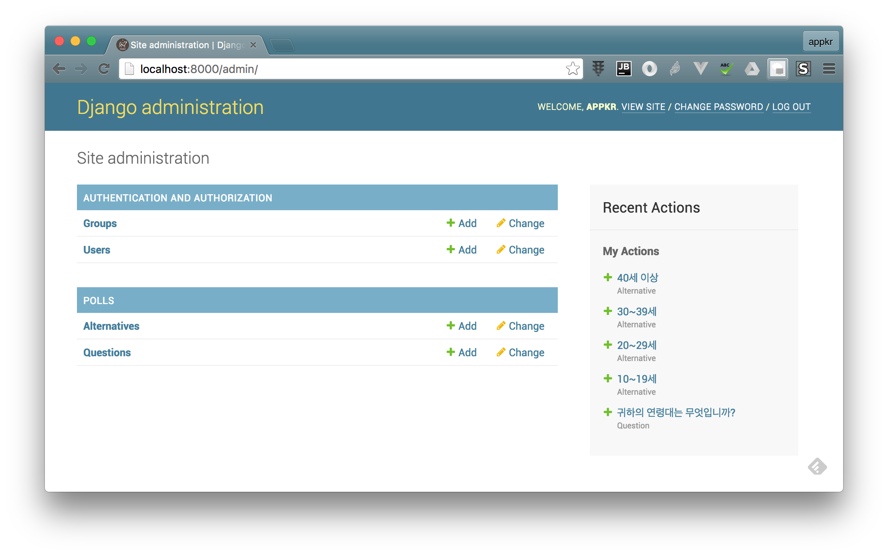
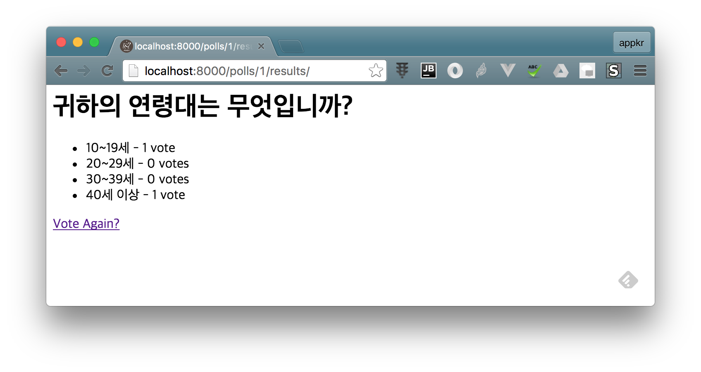

## Hello Django

For personal study purpose~

### [Cheatsheet] Make a Project

```sh
~ $ django-admin startproject foo_project
~ $ cd foo_project
~/foo_project $ python manage.py migrate                    # Users, Groups table migration
~/foo_project $ python manage.py createsuperuser
~/foo_project $ python manage.py runserver [0.0.0.0:8000 &] # & for daemon
```

Once the development server is up...



> In order to install IntelliJ's python SDK setting, press <kbd>Cmd</kbd> + <kbd>;</kbd>

#### Make an App

```sh
~/foo_project $ python manage.py startapp bar_app
```

### How to Replay

```sh
~ $ git clone git@github.com:appkr/hello-django.git
~/hello-django $ cd hello-django
~/hello-django $ python manage.py migrate
~/hello-django $ python manage.py runserver
```

Seed test data at Django admin and navigate to `http://localhost:8000/polls`

